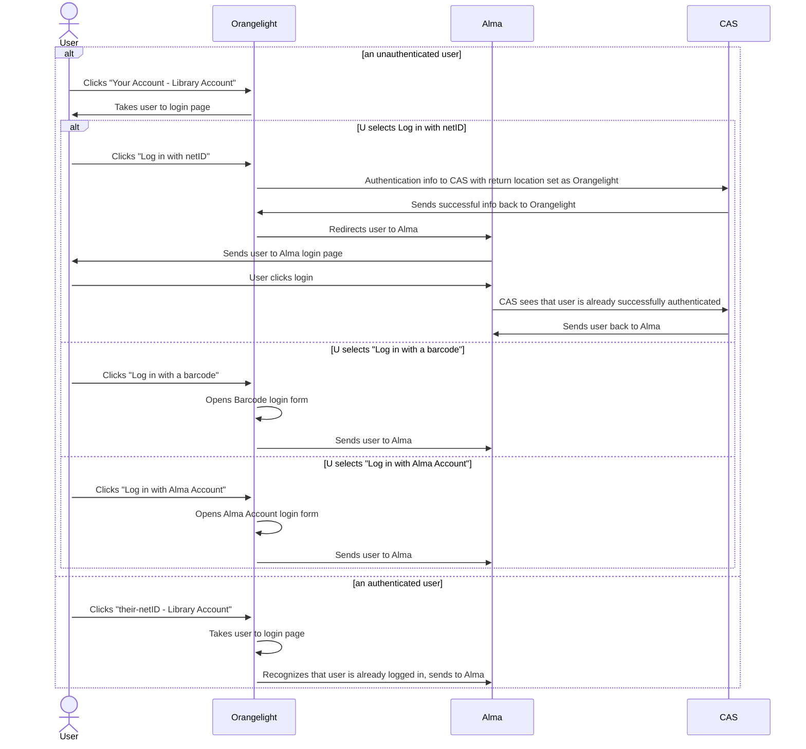

```mermaid
sequenceDiagram
accTitle: Alma Orangelight Login Process
accDescr {
  An unauthenticated user clicks "Your Account - Library Account" on Orangelight, which takes the user to the login page.
  If this user selects Log in with netID, The user clicks "Log in with netID" on Orangelight.
  Orangelight sends Authentication info to CAS with return location set as Orangelight. CAS sends successful info back to Orangelight.
  Orangelight redirects the user to Alma. Alma sends the user to the Alma login page, where the user clicks login.
  Alma sends the user info to CAS, and CAS sees that user is already successfully authenticated, and sends the user back to Alma.
  If the user selects log in with barcode, the user clicks "Log in with a barcode" on orangelight. Orangelight opens the barcode login form, and sends the user to Alma.
  If the user selects "Log in with Alma Account", the user clicks "Log in with Alma Account" on orangelight. Orangelight opens the alma account login form, and sends the user to Alma.

  If the user is authenticated, they click "their-netID - Library Account" on Orangelight. Orangelight takes them to the login page, recognizes the user is already logged in and redirects them to Alma.
}
actor U as User
participant O as Orangelight
participant A as Alma
participant C as CAS
alt an unauthenticated user
  U->>+O: Clicks "Your Account - Library Account"
  O->>+U: Takes user to login page
  alt U selects Log in with netID
    U->>O: Clicks "Log in with netID"
    O->>C: Authentication info to CAS with return location set as Orangelight
    C->>O: Sends successful info back to Orangelight
    O->>A: Redirects user to Alma
    A->>U: Sends user to Alma login page
    U->>A: User clicks login
    A->>C: CAS sees that user is already successfully authenticated 
    C->>A: Sends user back to Alma
  else U selects "Log in with a barcode"
    U->>O: Clicks "Log in with a barcode"
    O->>O: Opens Barcode login form
    O->>A: Sends user to Alma
  else U selects "Log in with Alma Account"
    U->>O: Clicks "Log in with Alma Account"
    O->>O: Opens Alma Account login form
    O->>A: Sends user to Alma
  end
else an authenticated user
  U->>O: Clicks "their-netID - Library Account"
  O->>O: Takes user to login page
  O->>A: Recognizes that user is already logged in, sends to Alma
end 
```
