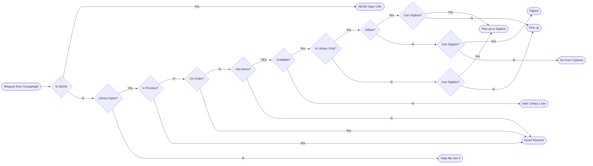

```mermaid
graph LR;
REQ([Request from Orangelight])-->AEON{In AEON}
AEON--Yes----------->AEONSYS([AEON Open URL])
AEON--No-->OPEN{Library Open?}
OPEN--Yes-->INPROCESS{In Process?}
OPEN--No---------->HELP([Help Me Get It])
INPROCESS--No-->ONORDER{On Order?}
INPROCESS--Yes-->EMAIL([Email Request])
ONORDER--No-->ITEMS{Has Items?}
ITEMS--YES-->AVAIL{Available?}
AVAIL--Yes-->INLIB{In Library Only?}
ITEMS--No------->EMAIL
ONORDER--Yes-->EMAIL
AVAIL--No------>ILL([Inter Library Loan])
INLIB--Yes-->OFFSITE{"Offsite?"}
INLIB--No-->DIG{Can Digitize?}
DIG--Yes-->PICKDIG
DIG--No-->PICK
OFFSITE--Yes-->OFFSITEDIG{Can Digitize?}
OFFSITE--No-->OFFSITEINDIG{Can Digitize?}
OFFSITEINDIG--Yes--->DIGITIZE([Digitze])
OFFSITEINDIG--No--->NOOPT([No Form Options ])
OFFSITEDIG--Yes--->PICKDIG([Pick-up or Digitize])
OFFSITEDIG--No--->PICK([Pick-up])
```
