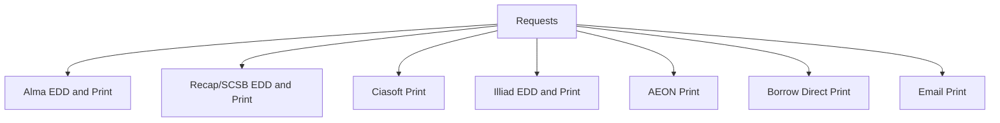

# PUL Requests

Requests was once a separate gem housed at https://github.com/pulibrary/requests.  To review code history and issues visit that repository.
The gem was integrated into orangelight in April of 2022 by moving the code from one repository to the other and making minimal changes.  Files in orangelight should be in the same folders in the Request repository.  As this code gets more fully integrated and changes there may not be a corresponding file in the old repository.

## External Interfaces



* [Borrow Direct](https://catalog.princeton.edu/borrow-direct)
  Can cancel requests by connecting to the URL above
  * Used to request items from partners.  Only connects for unavailable items that include an ISBN number
* Illiad
  Can cancel request from [orangelight](https://catalog.princeton.edu/account/digitization_requests)
  * Used to request unavailable items that are not borrow direct eligible.
  * Used to request Digitizations
* [Alma](https://princeton.alma.exlibrisgroup.com/discovery/account?vid=01PRI_INST:Services&lang=EN&section=overview)
  can cancel request by connecting to the URL above
  * Used to request pick-up of available items on the shelf
  * Holds are created for ReCAP Items when physical delivery is requested
  * Holds are requested for Marquand Offsite (clancy) items when physical or digital item is requested
* Clancy (ciasoft)
  All requests on qa and staging go to a test system, so they do not need to be canceled
  * Used to request items from Marquand
    1. Check if items are present in Clancy (all Marquand items not stored in ReCAP)
    1. If present both digital and pick-up request require the physical item to be sent to Princeton campus
* ReCAP
   **Can Not cancel requests sent to ReCAP**
  * Used to request physical pickup of off site materials
    **A hold in Alma is also created for a physical request.  This can and should be canceled during testing.**
  * Used to request a digital copy of off site materials
    **Test should be put in as many fields as possible in a test request.  Usually they note the test and do not do the digitization**

## Basic Usage

### Routes
* When installed a request form can be generated by passing a record identifier within the following route using one of three ID schemes currently available in Orangelight:

1. ```/requests/{mms_id}?mfhd={holding_id}``` Example: https://catalog.princeton.edu/requests/9702169?mfhd=9525518
  a. Optional Params
    1. ```source``` https://catalog.princeton.edu/requests/9702169?mfhd=9525518&source=pulsearch - Facilitates redirection to the source system that generated the request. Currently responds to ```pulsearch``` or ```catalog```, other values will be ignored.
2. ```/requests/{thesis_id}``` Example: https://catalog.princeton.edu/requests/dsp01vx021h212. This will result in a redirect to the AEON system.

## Testing User Roles

Under current campus access policies if you are interactively testing this gem you need to grant your net ID full campus access privileges. You can do by adding your net ID to the campus access list in the bibdata instance you are testing with. To do so:

1. Connect to the server. ```ssh deploy@bibdata-alma-staging1```
2. Change to the directory where the rails app is running. ```cd /opt/marc_liberation/current```
2. Enter the rails console for environment you want to working with. ```RAILS_ENV=production bundle exec rails c```
3. Add your net ID: ```CampusAccess.create(uid:'mynetid')```


