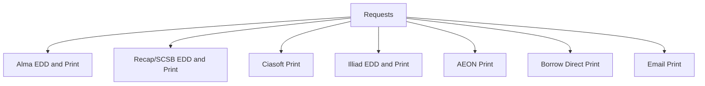

# PUL Requests

The engine requires a working copy of bibdata to be running. Defaults to https://bibdata-staging.princeton.edu. If you wish to override that value while doing development work and point a local working copy you can set your local environment variable of ```BIBDATA_BASE``` to the root of the marc_liberation application you want to work with.

The gem also is dependent on Orangelight to service requests for non-alma IDs. By default it utilizes the production Orangelight system at https://catalog.princeton.edu/.

### Chromedriver for Feature tests

You need to have a working version of Chromedriver http://chromedriver.chromium.org/ on your path to successfully run the feature tests associated with this project. Homebrew is a good way to accomplish this. It is currently part of https://github.com/Homebrew/homebrew-cask. 

## External Interfaces




## To Install for Development

After you've cloned the repo:

```
$ bundle install
$ bundle exec rake ci
```

With Code Coverage Report
```
$ COVERAGE=true bundle exec rake ci
```

## Working within Orangelight locally
This engine is mouting within Orangelight. To test your local engine code interactively update the OL gemfile reference to the gemfile:

Change:
```
gem 'requests', git: 'git@github.com:pulibrary/requests.git', branch: 'development'
```

to:
```
gem 'requests', path: '/mylocal/path/to/the/gem/requests'
```

and run ```bundle update requests``` to point your local copy of OL at your local requests gem.


## Install in Production

* Add ```gem 'requests', :git 'git@github.com:pulibrary/requests.git'```
* ```bundle install```
* ```rails generate requests:install```

This project rocks and uses MIT-LICENSE.

## Basic Usage

### Routes
* When installed a request form can be generated by passing a record identifier within the following route using one of three ID schemes currently available in Orangelight:

1. ```/requests/{mms_id}?mfhd={holding_id}``` Example: https://catalog.princeton.edu/requests/9702169?mfhd=9525518
  a. Optional Params
    1. ```source``` https://catalog.princeton.edu/requests/9702169?mfhd=9525518&source=pulsearch - Facilitates redirection to the source system that generated the request. Currently responds to ```pulsearch``` or ```catalog```, other values will be ignored.
2. ```/requests/{thesis_id}``` Example: https://catalog.princeton.edu/requests/dsp01vx021h212. This will result in a redirect to the AEON system.

## Testing User Roles

Under current campus access policies if you are interactively testing this gem you need to grant your net ID full campus access privileges. You can do by adding your net ID to the campus access list in the bibdata instance you are testing with. To do so:

1. Connect to the server. ```ssh deploy@bibdata-alma-staging1.princeton```
2. Change to the directory where the rails app is running. ```cd /opt/marc_liberation/current```
2. Enter the rails console for environment you want to working with. ```RAILS_ENV=production bundle exec rails c```
3. Add your net ID: ```CampusAccess.create(uid:'mynetid')```


