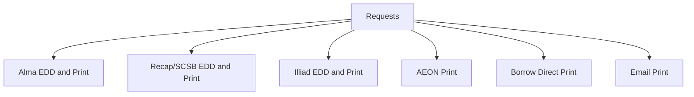
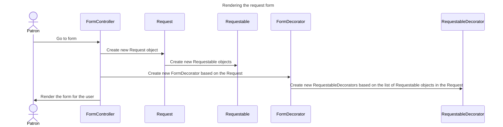
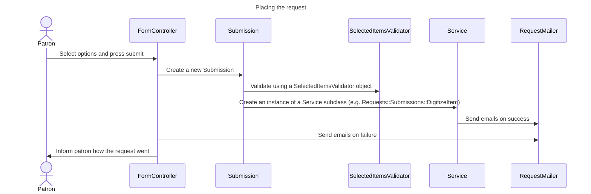

# PUL Requests

Requests was once a separate gem housed [in a separate repository](https://github.com/pulibrary/requests).  To review code history and issues visit that repository.
The gem was integrated into orangelight in April of 2022 by moving the code from one repository to the other and making minimal changes.  Files in orangelight should be in the same folders in the Request repository.  As this code gets more fully integrated and changes there may not be a corresponding file in the old repository.

## External Interfaces



* [Borrow Direct](https://catalog.princeton.edu/borrow-direct)
  * Used to find items from partners. Has switched to the [ReShare platform](https://projectreshare.org/), and requests are made via Illiad (see below)
* Illiad
  Can cancel request from [orangelight](https://catalog.princeton.edu/account/digitization_requests)
  * Used to request unavailable items that are deemed eligible for a resource sharing request
  * Used to request Digitizations
* [Alma](https://princeton.alma.exlibrisgroup.com/discovery/account?vid=01PRI_INST:Services&lang=EN&section=overview)
  can cancel request by connecting to the URL above
  * Used to request pick-up of available items on the shelf
  * Holds are created for ReCAP Items when physical delivery is requested
* ReCAP    
    Important: **cannot cancel requests sent to ReCAP**
  * Used to request physical pickup of off site materials.    
    Important: **a hold in Alma is also created for a physical request.  This can and should be canceled during testing.**
  * Used to request a digital copy of off site materials.    
    Important: **test should be put in as many fields as possible in a test request.  Usually they note the test and do not do the digitization**

## Basic Usage

### Routes
A request form can be generated by passing a record identifier within the following route:

```/requests/{mms_id}?mfhd={holding_id}``` Example: https://catalog.princeton.edu/requests/9997021693506421?aeon=false&mfhd=22597335790006421    


## Architecture

### Rendering the request form



### Placing the request



