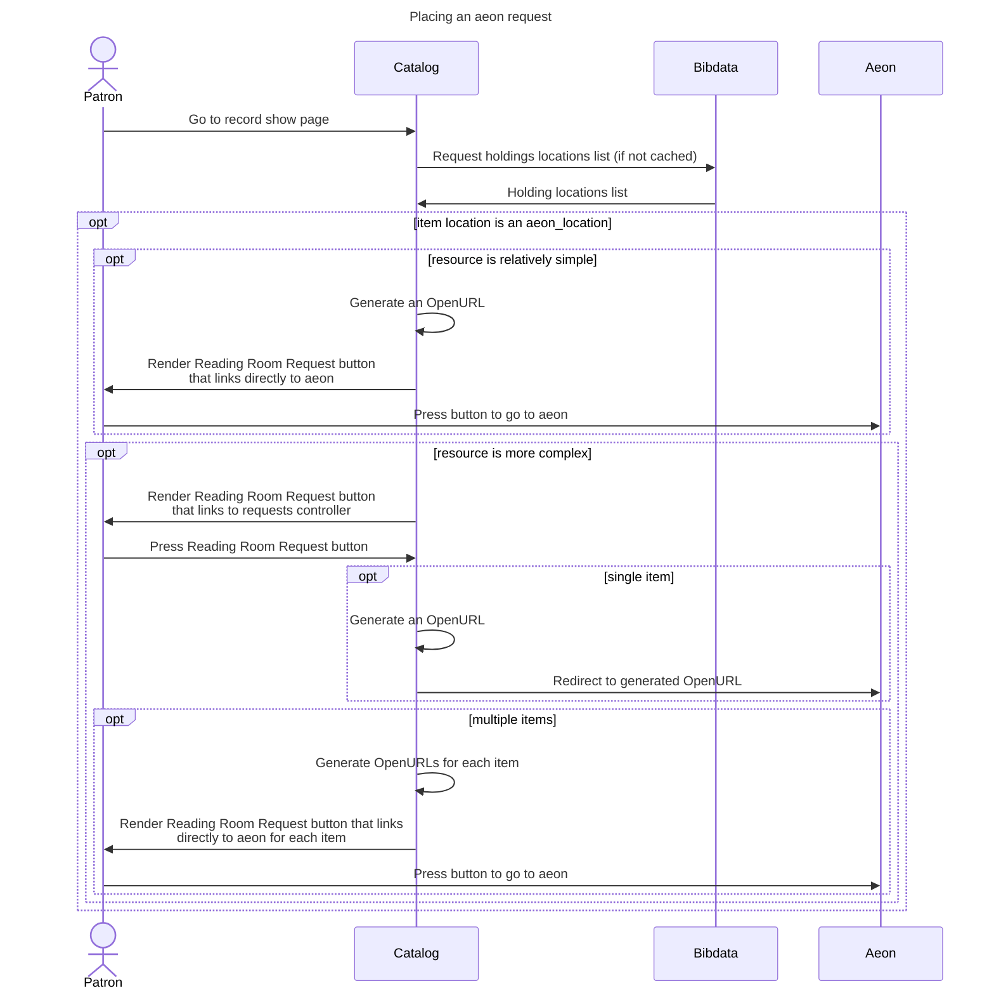

### Aeon requests integration

#### Sequence of a request

An Aeon request goes through the following steps, as illustrated by the diagram below:

1. Patron goes to record show page
1. Catalog fetches holdings locations list from bibdata (if not cached)
1. If the item location is an aeon_location:
    1. If the resource is relatively simple:
        1. Catalog generates an OpenURL
        1. Catalog renders Reading Room Request button that links directly to aeon
        1. Patron presses button to go to aeon.
    1. If the resource is more complex:
        1. Catalog renders Reading Room Request button that links to requests controller
        1. Patron presses Reading Room Request button
        1. If it's a single item:
            1. Catalog generates an OpenURL
            1. Catalog redirects to generated OpenURL
        1. If it's multiple items:
            1. Catalog generates an OpenURL for each item
            1. Catalog renders a Reading Room Request button that links directly to aeon for each item
            1. Patron presses button to go to aeon
### Aeon requests mermaid

