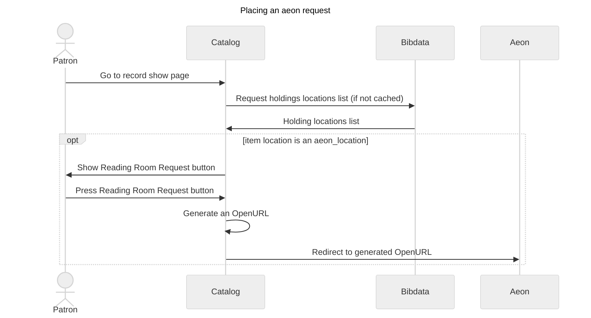

```mermaid
sequenceDiagram
%%{init: {'theme': 'neutral'}}%%
    title Placing an aeon request
    actor patron as Patron
    patron->>Catalog: Go to record show page
    Catalog->>Bibdata: Request holdings locations list (if not cached)
    Bibdata->>Catalog: Holding locations list
    opt item location is an aeon_location
      Catalog->>patron: Show Reading Room Request button
      patron->>Catalog: Press Reading Room Request button
      Catalog->>Catalog: Generate an OpenURL
      Catalog->>Aeon: Redirect to generated OpenURL
    end
```
