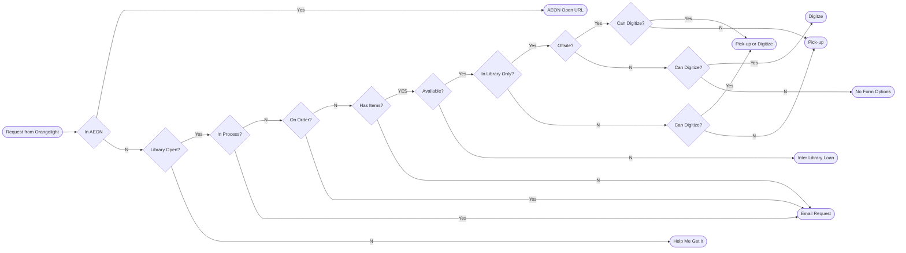

```mermaid
graph LR;
accTitle: The Working of Request Forms.
accDescr {
  The request from Orangelight goes to AEON.
  If AEON is able to handle this, the user is redirected to AEON Open URL. If not, we check if the library is open.
  If the library is open, we check if it is in process. If it is closed, the user must request for help in obtaining the item.
  If the library is in process, an email request is sent. If not, we check if the item is on order.
  If the item is not on order, we check if the library has this item. If the item is on order, an email is sent. If it is, we check if it is available.
  If it is available, we check if the item can be accessed in the library only. If yes, we check if this is offsite. If not, we check if the item can be digitized. 
  If it can be digitized, the user can either pick it up or receive the digitized copy. If not, the user can pick it up.
  If the item is offsite, and can be digitized, the user can either pick it up or receive the digitized copy. If this cannot be digitized, the user can pick it up.
  If the item is not offsite, we check if it can be digitized. If yes, the user receives the digitized copy. If not, there are no form options.
  If it is not available, an inter-library loan is initiated.
  If the library does not have this item, an email is sent.
   
}
REQ([Request from Orangelight])-->AEON{In AEON}
AEON--Yes----------->AEONSYS([AEON Open URL])
AEON--No-->OPEN{Library Open?}
OPEN--Yes-->INPROCESS{In Process?}
OPEN--No---------->HELP([Help Me Get It])
INPROCESS--No-->ONORDER{On Order?}
INPROCESS--Yes-->EMAIL([Email Request])
ONORDER--No-->ITEMS{Has Items?}
ITEMS--YES-->AVAIL{Available?}
AVAIL--Yes-->INLIB{In Library Only?}
ITEMS--No------->EMAIL
ONORDER--Yes-->EMAIL
AVAIL--No------>ILL([Inter Library Loan])
INLIB--Yes-->OFFSITE{"Offsite?"}
INLIB--No-->DIG{Can Digitize?}
DIG--Yes-->PICKDIG
DIG--No-->PICK
OFFSITE--Yes-->OFFSITEDIG{Can Digitize?}
OFFSITE--No-->OFFSITEINDIG{Can Digitize?}
OFFSITEINDIG--Yes--->DIGITIZE([Digitze])
OFFSITEINDIG--No--->NOOPT([No Form Options ])
OFFSITEDIG--Yes--->PICKDIG([Pick-up or Digitize])
OFFSITEDIG--No--->PICK([Pick-up])
```
