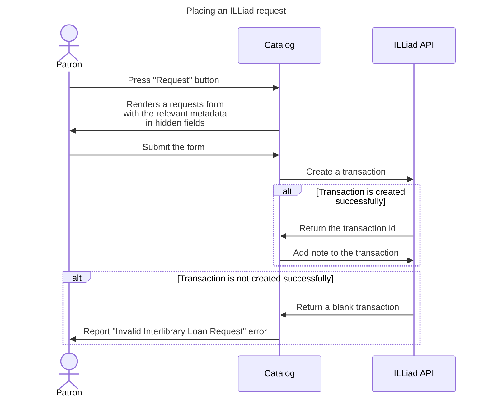

### ILLiad requests integration

#### Sequence of a request

An ILLiad request goes through the following steps, as illustrated by the diagram below:

1. Patron presses the "Request" button
1. Catalog renders a request form with the relevant metadata in hidden fields.
1. Patron submits the form.
1. Catalog creates a transaction via the ILLiad API.
1. If transaction is created successfully:
    1. ILLiad API returns the transaction ID.
    1. Catalog uses the transaction ID to add a note via the ILLiad API.
1. If transaction is not created successfully:
    1. ILLiad API returns a blank transaction
    1. Catalog reports "Invalid Interlibrary Loan Request" error to patron
### ILLiad Request Mermaid

