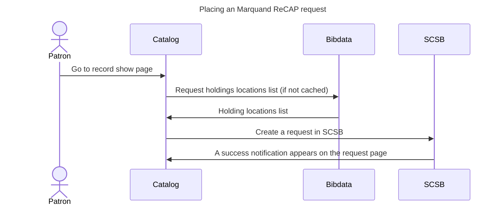

# Marquand requests integration

## Sequence of a request
All Marquand items are back on campus but shipped to Firestone for use through at least Jan 2026, until the Marquand library reopens.

### Requests for "remote" items in on campus storage
A Marquand request for an item in on campus storage goes through the following steps:

1. Patron presses the "Request" button
1. Catalog renders a request form with the relevant metadata in hidden fields.
1. Patron submits the form.
1. The request is handled as an [Aeon request](aeon.md)

### Requests for items in remote storage (in ReCAP)
A Marquand request for an item in ReCAP goes through the following steps, as illustrated by the diagram below:

1. Patron presses the "Request" button
1. Catalog renders a request form with the relevant metadata in hidden fields.
1. Patron submits the form.
1. Catalog creates a SCSB request

